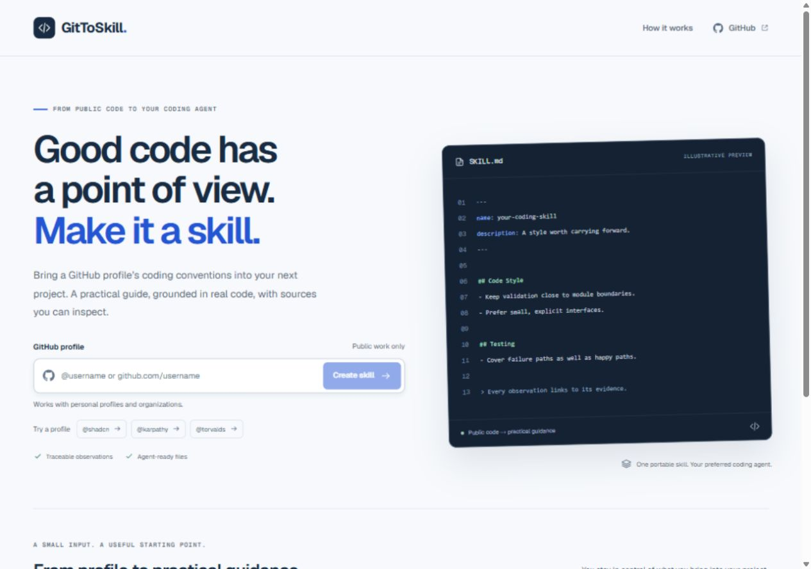
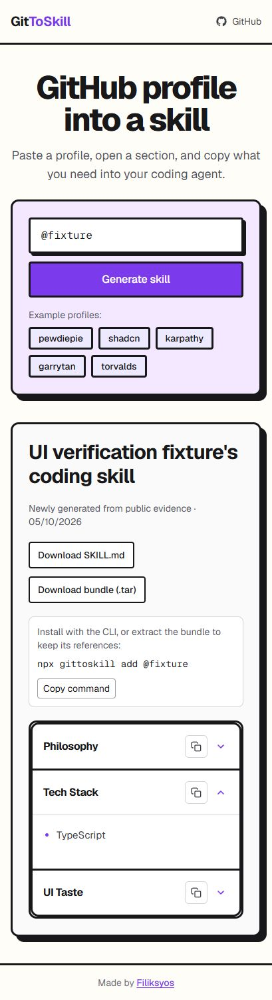
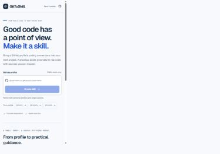
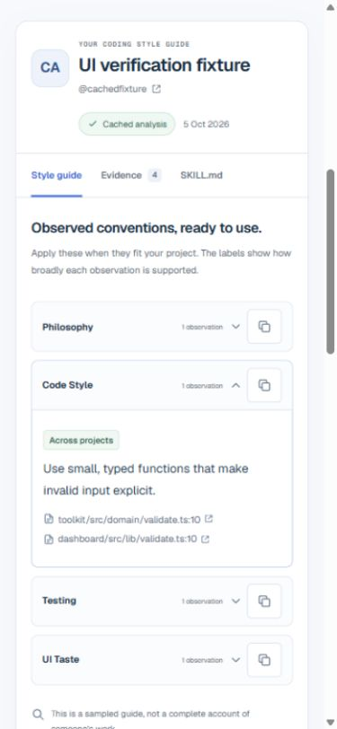
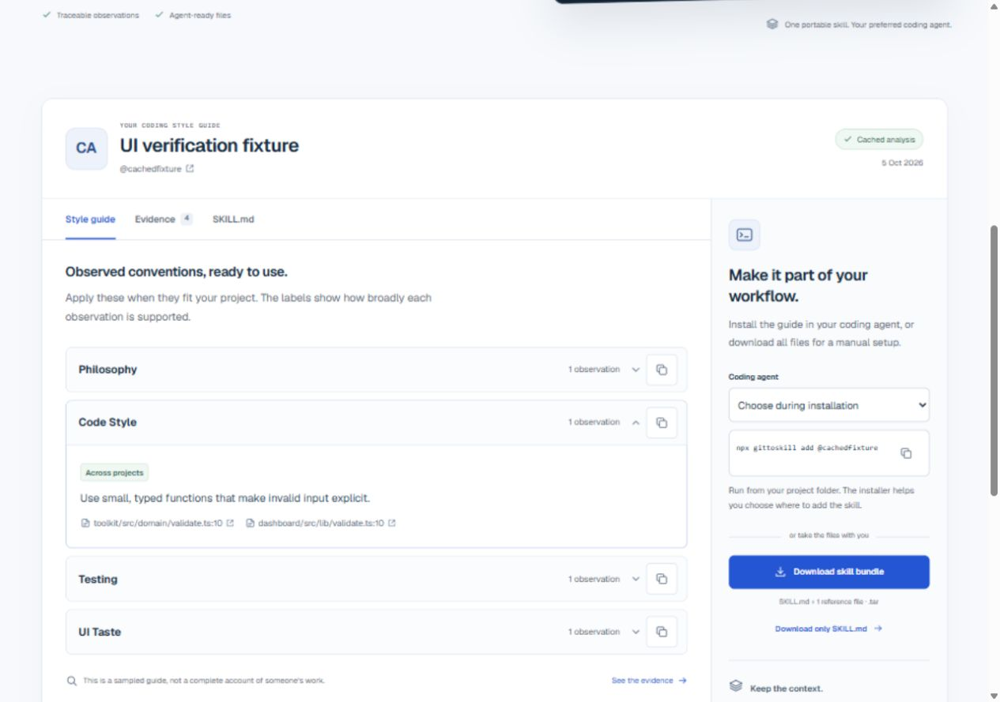

# GitToSkill

[](https://github.com/ZEBDA1/gittoskill/actions/workflows/ci.yml)
[](LICENSE)

**Turn a public GitHub profile into a coding skill you can inspect, export and use with your agent.**

GitToSkill looks at implementation, tests and configuration across a bounded sample of public repositories. It turns supported conventions into a style guide with source citations, attribution and explicit limitations.

This is a fork of [filiksyos/gittoskill](https://github.com/filiksyos/gittoskill). Credit and the original Git history are preserved. This fork adds a redesigned English interface, stronger evidence attribution, a more reliable backend and security hardening.



## Before and after

The previous interface used a single form and stacked result cards. The redesign introduces a clearer profile entry, a dedicated result workspace and separate **Style guide**, **Evidence** and **SKILL.md** views.

| Before the redesign | New homepage | New result workspace |
| :---: | :---: | :---: |
|  |  |  |

The before capture was taken after the first backend modernization and before the visual redesign. Result screenshots use synthetic test data; they do not represent a real analysis of the displayed account. The homepage preview is illustrative.

<details>
<summary>See the desktop style guide</summary>



</details>

## Major improvements

| Area | What changed |
| --- | --- |
| Experience | Responsive English interface, keyboard-accessible tabs, visible focus, reduced-motion support, cancellation, retry and preserved input. |
| Evidence | Ownership, activity and language diversity guide repository selection. Public contributions and GitHub blame help distinguish project conventions from profile-attributed excerpts. |
| Accuracy | Every observation cites known evidence. Unsupported sections are omitted; organizations describe team conventions. Coverage measures sample breadth, never an invented accuracy score. |
| Generation | Structured model output, bounded requests, timeouts, safe errors and source/category validation. |
| Reliability | Shared Redis cache, atomic quotas and locks, duplicate-request coalescing and controlled production configuration errors. |
| Performance | Results, Markdown fallback and archive preparation load on demand. Measured initial modern JavaScript was 13.9% smaller in gzip than the original version. |
| Installation | Separate CLI package, validated paths and bundles, staging, locking and snapshot rollback. Linked `.gitignore` files are rejected; updates use atomic replacement. |
| Security | HTTPS-only Azure endpoints, browser security headers, server-side credentials, opt-in analytics, GitHub secret protection and dependency monitoring. |

The JavaScript comparison is a local production-build measurement (169,244 → 145,681 bytes gzip), not a Core Web Vitals or backend latency benchmark. See [changes and validation](docs/CHANGES.md).

## How it works

1. Enter `@username` or a GitHub profile URL. Examples fill the form; generation begins when you submit.
2. Inspect the style guide, source files and attribution in the result workspace.
3. Download `SKILL.md` or the complete `.tar` bundle, including references.
4. Review the generated instructions before using them with Cursor, Codex or Claude Code.

Only public evidence is sampled, from up to four repositories. Forks, templates, archived repositories and profile READMEs are excluded from implementation selection. A pinned repository alone does not establish authorship. The model may return no observations when evidence is insufficient. Private work and a developer's full history remain outside the guide.

## Run locally

Requires **Node.js 24+** and **pnpm 11.25.0**.

```sh
pnpm install --frozen-lockfile --ignore-scripts
```

Copy [`.env.example`](.env.example) to `.env.local` and configure:

| Variable | Purpose |
| --- | --- |
| `GITHUB_TOKEN` | Read public GitHub repositories. |
| `AZURE_OPENAI_API_KEY` | Server-side Azure credential. |
| `AZURE_OPENAI_BASE_URL` | HTTPS endpoint, such as `https://YOUR-RESOURCE.openai.azure.com/openai/v1`. |
| `AZURE_OPENAI_DEPLOYMENT_NAME_MAP` | Map the configured model to a deployment available in your Azure resource. |

The selected deployment must support strict JSON-schema output and the configured reasoning effort. Never commit credentials or expose them through `NEXT_PUBLIC_*` variables.

```sh
pnpm dev
```

Open [localhost:3000](http://localhost:3000). Development uses an in-memory cache unless Redis is configured.

## Deploy

Configure `GITTOSKILL_REDIS_REST_URL` and `GITTOSKILL_REDIS_REST_TOKEN` for an HTTPS Redis REST service supporting `GET`, `SET NX EX` and `EVAL`. Production requires shared storage by default and returns a controlled 503 when it is missing.

| Default limit | Value |
| --- | --- |
| Cache lifetime | 12 hours |
| Requests per client | 30 per 15 minutes |
| New generations across the deployment | 100 per hour |
| Concurrent generations | 4 |
| Generation deadline | 80 seconds |

Additional options are documented in [`.env.example`](.env.example). `GITTOSKILL_ALLOW_MEMORY_STORE=true` is reserved for an intentional single-instance deployment; it cannot coordinate workers and resets on restart.

Set `NEXT_PUBLIC_SITE_URL` to your own canonical origin before building. Analytics requires `NEXT_PUBLIC_ENABLE_ANALYTICS=true`. Enable `GITTOSKILL_TRUST_PROXY` only when your trusted proxy overwrites client IP headers; Vercel uses its platform-provided header.

```sh
pnpm build
pnpm start
```

Before public launch, configure hosting-level bot/rate protection, review provider costs, and test the real GitHub/Azure/Redis configuration. Application quotas reduce abuse but do not guarantee availability or a fixed financial bill. Browser cancellation stops waiting; a bounded generation already in progress can finish for the cache and other users.

## CLI

The website and [`packages/cli`](packages/cli/README.md) are separate. This fork has **not published a new npm package**. Running `npx gittoskill` can therefore use a different published version.

To use this checkout against the local server in PowerShell:

```powershell
$env:GITTOSKILL_API_BASE_URL = 'http://localhost:3000'
pnpm cli:add -- @steipete --agent cursor
pnpm cli:add -- @steipete --list
```

For your deployed backend, set `GITTOSKILL_API_BASE_URL` to its HTTPS origin. The CLI's unchanged default points to the original project's `https://gittoskill.vercel.app`; a GitHub fork does not create a new hosted service.

Project installation is the default; pass `--global` for global scope. Bundles are validated before writing, and failed installers restore the previous cached snapshot. Changes made by the external `skills` installer in agent directories are outside that rollback.

## Validation and security

```sh
pnpm lint
pnpm typecheck
pnpm test
pnpm build
pnpm audit --prod
pnpm audit
```

CI validates Linux and Windows. Tests cover inputs, provider failures, citations, attribution, cache/quotas, CLI rollback, unsafe links, HTTPS configuration and UTF-8 archives. GitHub dependency updates are scheduled weekly; security alerts and automated security updates are enabled on this fork.

As of **October 5, 2026**, the production dependency audit reports **zero known vulnerabilities**. The full audit still reports **CVE-2026-93687** in development-only `braces 3.0.3`, with no published npm fix. CI exposes the full audit as a non-blocking check while the production audit remains blocking. This is a known limitation, not a claim that the project has no security flaws. See [security guidance](SECURITY.md).

Live paid generation, hosted Redis behavior and production load still require validation with the deployment's actual credentials. Review generated skills: source citations and structured output do not guarantee semantic correctness or immunity to prompt injection.

## Project layout

```text
app/             Website and generation API
components/      Profile form, result workspace and shared controls
lib/             GitHub/Azure clients, evidence, cache and archives
packages/cli/    CLI and shared bundle validation
tests/           Regression tests
docs/            Release notes and screenshots
```

## License

[MIT](LICENSE). Original project by [filiksyos](https://github.com/filiksyos).
