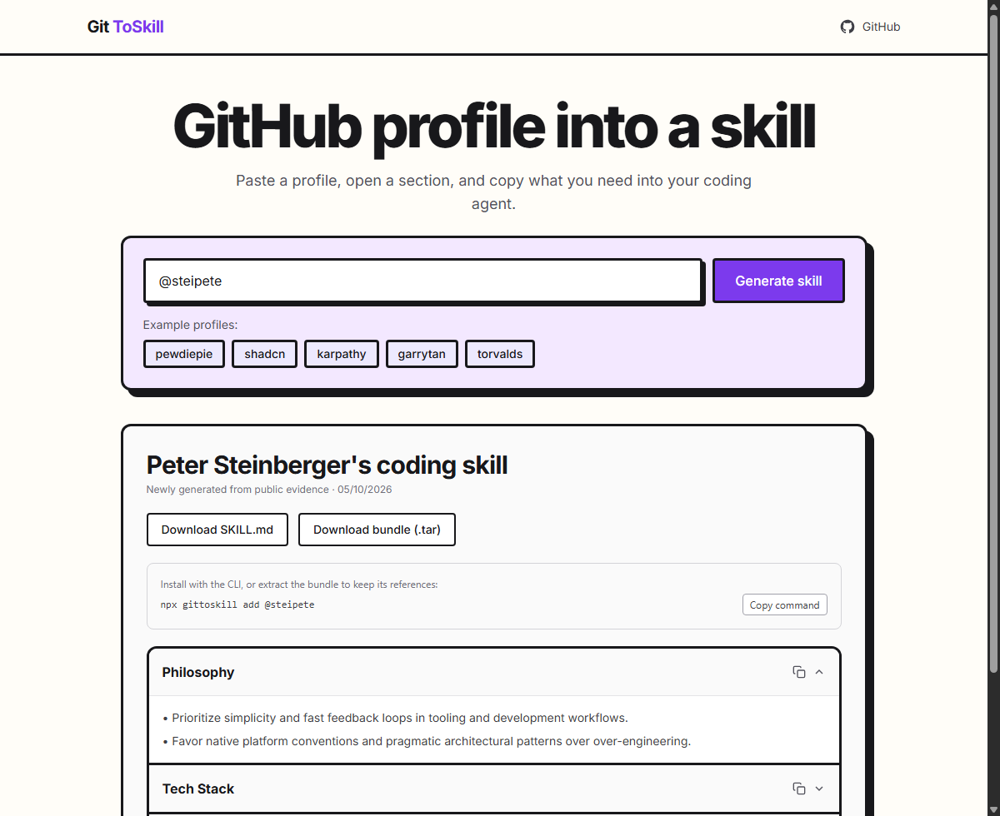
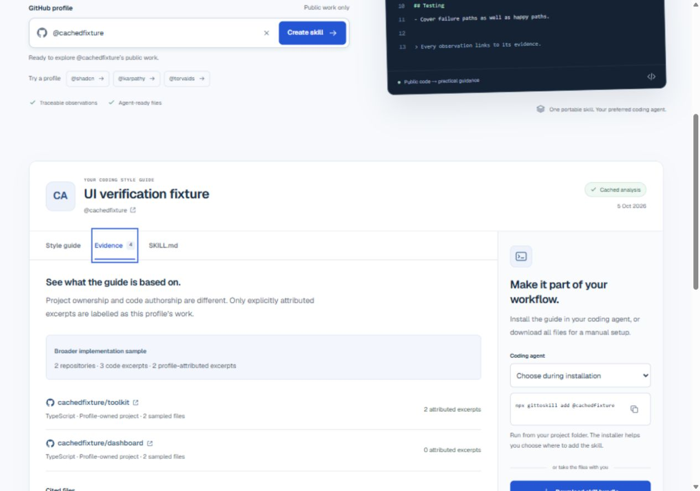
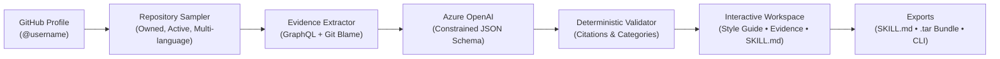

# GitToSkill

<p align="center">
  <a href="https://github.com/ZEBDA1/gittoskill/actions/workflows/ci.yml">
    
  </a>
  <a href="LICENSE">
    
  </a>
  
  
  
  
</p>

<p align="center">
  <strong>Turn any public GitHub profile into a verifiable coding skill for your AI agents.</strong><br>
  Ground your coding assistant in real-world conventions, with verifiable source citations, Git blame attribution, and multi-agent exports.
</p>

---

## Overview

**GitToSkill** analyzes public GitHub repositories, inspects implementation patterns, tests, and configurations, and generates a structured style guide and `SKILL.md` bundle compatible with **Cursor**, **Codex**, and **Claude Code**.

> [!NOTE]
> This repository is a modernized, redesigned fork of [filiksyos/gittoskill](https://github.com/filiksyos/gittoskill). Credit to the original creator and the complete Git history are preserved. This fork introduces a comprehensive visual redesign, a multi-tab evidence workspace, Git blame-level attribution, distributed Redis caching, and extensive security hardening.

---

## Visual Evolution: Before & After

The redesign transforms GitToSkill from a single-card neo-brutalist prototype into a refined, accessible developer workspace with deep evidence inspection and flexible agent deployment.

### 1. Desktop Experience: Original vs. Redesign

| Original Design ([filiksyos](https://github.com/filiksyos/gittoskill)) | Modern Redesign |
| :---: | :---: |
|  |  |
| *Neo-brutalist aesthetic: 3px heavy black outlines, purple container, offset drop shadows, and stacked accordion.* | *Clean developer UX: modern typography, subtle depth, live illustrative preview, and clear profile entry.* |

---

### 2. Result Workspace: Monolithic Accordion vs. Multi-Tab Inspector

The original interface displayed generated observations in simple stacked cards without verifiable source links. The redesigned workspace introduces three specialized views: **Style guide**, **Evidence**, and **SKILL.md**.

| Redesigned Style Guide Workspace | Verifiable Evidence & Attribution Tab |
| :---: | :---: |
|  |  |
| **Style Guide**: Structured sections (*Philosophy, Code Style, Testing, UI Taste*) with citations linking directly to repository files and line numbers. Includes an agent installer switcher (**Cursor, Codex, Claude Code**) and full bundle downloads. | **Evidence Tab**: Complete transparency over sampled repositories, distinguishing profile-owned projects from team conventions, displaying blame-attributed excerpt counts, and stating sample boundaries. |

---

### 3. Mobile Experience: Responsive Across All Form Factors

Every screen was redesigned and tested from 320px to 1280px, ensuring complete usability on mobile devices with visible keyboard focus and reduced-motion support.

| Original Mobile UI | Redesigned Mobile Homepage | Redesigned Mobile Result |
| :---: | :---: | :---: |
|  |  |  |
| *Stacked neo-brutalist mobile layout.* | *Mobile homepage with quick-pick profile chips.* | *Tabbed result workspace with full citation cards.* |

---

## Major Enhancements at a Glance

| Area | Original Baseline | Modern Redesign |
| :--- | :--- | :--- |
| **UI & Experience** | Neo-brutalist styling, stacked accordion cards, generic CLI output. | Modern responsive interface, multi-tab workspace (**Style guide**, **Evidence**, **SKILL.md**), agent selector (**Cursor / Codex / Claude Code**), keyboard accessibility (tabs, Home/End, visible focus), cancellation & retry support. |
| **Evidence & Attribution** | Pinned repositories and profile README only; no blame attribution. | Bounded sampling (up to 4 repositories) prioritizing ownership, activity, and language diversity. Filters out forks, templates, and archived repos. Distinguishes profile authorship from team conventions using GitHub blame. |
| **Verifiability** | Uncited model claims; no validation of evidence. | Every observation cites real files and line numbers. Unsupported sections are omitted. Clear sample boundaries; no fabricated "accuracy scores". |
| **Performance** | Monolithic bundle; Markdown and archive logic loaded on first visit. | **13.9% reduction in initial modern JavaScript** (169,244 → 145,681 bytes gzip). Results, Markdown rendering, and archive generation load strictly on demand. |
| **Backend & Cache** | In-memory generation prone to duplicate requests and high LLM costs. | Shared Redis REST cache, atomic distributed locks, request coalescing (8 simultaneous requests = 1 generation), configurable hourly quotas and generation deadlines. |
| **CLI & Packaging** | Single script coupled to web dependencies; unvalidated writes. | Independent [`packages/cli`](packages/cli/README.md) package; sandboxed path validation, exclusive locks, atomic file replacement, and snapshot rollback on failure. |
| **Security & Hardening** | 43 production audit alerts in dependencies; missing HTTP security headers. | **0 known production vulnerabilities**. HTTPS-only Azure endpoints, strict CSP, frame-ancestors protection, `nosniff`, and automated Dependabot updates. |

*Bundle size comparison is a local production build measurement (169,244 → 145,681 bytes gzip), excluding nomodule polyfills. See [detailed change report](docs/CHANGES.md).*

---

## How It Works



1. **Enter a Profile**: Input `@username` or a GitHub profile URL. Quick-start examples populate the form without auto-triggering requests.
2. **Repository Qualification**: The sampler selects up to four public repositories based on ownership, recent activity, and language diversity. Forks, templates, archived projects, and profile READMEs are excluded from implementation analysis.
3. **Evidence Extraction**: The engine samples code, test cases, and configuration files. Commits and Git blame distinguish individual authorship from organizational conventions.
4. **Structured Generation**: Azure OpenAI generates observations under a strict JSON schema with strict category rules and token budgets.
5. **Deterministic Verification**: Citations, line ranges, and scopes are verified against the collected evidence before presentation.
6. **Deploy to Your Agent**: Inspect the resulting style guide, view supporting evidence, copy agent-specific commands (`npx gittoskill add`), or download the complete `.tar` archive.

---

## Quickstart & Local Development

### Prerequisites

- **Node.js 24+** (LTS recommended)
- **pnpm 11.25.0+**

### Installation

```bash
# Clone the repository
git clone https://github.com/ZEBDA1/gittoskill.git
cd gittoskill

# Install dependencies with frozen lockfile
corepack pnpm install --frozen-lockfile --ignore-scripts
```

### Environment Configuration

Copy [`.env.example`](.env.example) to `.env.local` and set your credentials:

```bash
cp .env.example .env.local
```

| Variable | Description |
| :--- | :--- |
| `GITHUB_TOKEN` | Personal Access Token to read public repositories via GitHub GraphQL. |
| `AZURE_OPENAI_API_KEY` | Server-side Azure OpenAI credential. |
| `AZURE_OPENAI_BASE_URL` | HTTPS endpoint (e.g. `https://YOUR-RESOURCE.openai.azure.com/openai/v1`). |
| `AZURE_OPENAI_DEPLOYMENT_NAME_MAP` | Map target models to your deployed Azure models. |
| `GITTOSKILL_ALLOW_MEMORY_STORE` | Set to `true` for local development without Redis. |

### Run Dev Server

```bash
corepack pnpm dev
```

Open [http://localhost:3000](http://localhost:3000).

---

## CLI Integration

The CLI package is located in [`packages/cli`](packages/cli/README.md) and can be run locally against your dev server:

```powershell
# PowerShell
$env:GITTOSKILL_API_BASE_URL = 'http://localhost:3000'
pnpm cli:add -- @steipete --agent cursor
pnpm cli:add -- @steipete --agent claude-code
pnpm cli:add -- @steipete --list
```

```bash
# Bash / Zsh
GITTOSKILL_API_BASE_URL="http://localhost:3000" pnpm cli:add -- @steipete --agent cursor
```

> [!TIP]
> The CLI validates bundle integrity, path boundaries, and reserved names before writing to disk. If an installation fails, the CLI automatically restores the previous snapshot.

---

## Production Deployment

Production deployments require shared storage via Redis REST (`GET`, `SET NX EX`, `EVAL`) to coordinate rate limits, distributed locks, and request deduplication.

| Limit | Default Value |
| :--- | :--- |
| **Cache Lifetime** | 12 hours |
| **Rate Limit** | 30 requests per 15 minutes per client IP |
| **Global Generation Quota** | 100 generations per hour |
| **Concurrent Generations** | 4 simultaneous generations |
| **Generation Deadline** | 80 seconds timeout |

Configure `GITTOSKILL_REDIS_REST_URL` and `GITTOSKILL_REDIS_REST_TOKEN` in your deployment environment (e.g., Upstash or hosted Redis).

```bash
# Build and run production server
corepack pnpm build
corepack pnpm start
```

---

## Quality & Security Verification

The project includes an automated test suite, strict TypeScript checks, and security audits:

```bash
corepack pnpm lint        # ESLint 9 checks (0 warnings)
corepack pnpm typecheck   # TypeScript check (strict mode)
corepack pnpm test        # 32 automated unit and integration tests
corepack pnpm build       # Production Next.js build
corepack pnpm audit --prod # Production dependency audit (0 known vulnerabilities)
```

CI workflows run on every pull request and push across **Linux** and **Windows** environments. See [SECURITY.md](SECURITY.md) for vulnerability disclosure and threat model details.

---

## Project Structure

```text
gittoskill/
├── app/                  # Next.js App Router (homepage, layout, /api routes)
├── components/           # UI components (profile-workspace, skill-workspace)
├── lib/                  # Core engine:
│   ├── github-client.ts  # GitHub GraphQL client & rate-limit handling
│   ├── github-evidence.ts# Repository sampling & Git blame attribution
│   ├── azure-openai.ts   # Azure LLM client with structured JSON output
│   ├── profile-analysis.ts # Analysis normalization & citation verifier
│   └── generation-store.ts # Distributed Redis cache & lock manager
├── packages/
│   └── cli/              # Isolated CLI tool with atomic bundle installer
├── tests/                # Regression tests (cache, CLI, citations, UTF-8 archives)
├── docs/                 # Documentation & media
│   ├── images/           # Before & after UI captures
│   └── CHANGES.md        # Detailed engineering and audit logs
└── SECURITY.md           # Security policy and dependency status
```

---

## Credits & License

- **Original Project**: Created by [filiksyos](https://github.com/filiksyos) ([filiksyos/gittoskill](https://github.com/filiksyos/gittoskill)).
- **Modernization & Redesign**: [ZEBDA1](https://github.com/ZEBDA1/gittoskill).
- **License**: [MIT](LICENSE).
